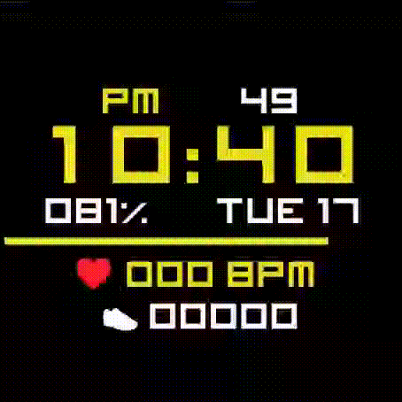

# Beam Up Pixel

A Wear OS watch face that recreates the classic "Beam Up" digital watch face with sci-fi teleportation beam animations when digits change.

## Description

Beam Up Pixel is a modern adaptation of the original [Beam Up watch face](https://github.com/C-D-Lewis/beam-up) created by [Chris Lewis](https://github.com/C-D-Lewis) for the [Pebble smartwatch](https://getpebble.com/). This implementation brings the iconic tractor beam animation effect to modern Wear OS devices with a minimalist retro vibe.

The watch face displays the time in a bold digital format using the Imagine font. When digits change (at the end of each minute), white tractor beams animate upward from the bottom of the screen, "beaming up" the old digits and "beaming down" the new ones. This creates a unique sci-fi aesthetic that makes checking the time an engaging visual experience.

While inspired by the original, this implementation includes some updates for modern smartwatches:
- **Progress bar**: Updates every second (instead of every 15 seconds) for compatibility with modern Wear OS power management
- **Beam animation**: Features an updated visual style with enhanced timing and effects

### Features

- **Digital Time Display**: Large, easy-to-read digits in 12-hour format
- **Beam Animation**: Four-phase animation sequence when digits change:
  - Phase 1: Beam extends upward to reach the old digit
  - Phase 2: Old digit fades out as it's "transported"
  - Phase 3: New digit fades in as it's "materialized"
  - Phase 4: Beam retracts back down
- **Synchronized Effects**: All changing digits animate simultaneously for a cohesive effect
- **Monospace Font**: Uses the classic Imagine font for authentic digital watch aesthetics
- **Optimized Performance**: Hardware-accelerated rendering for smooth 60fps animations

## Animated Preview



## Building and Installation

### Prerequisites

1. **Android Studio** - Download and install [Android Studio](https://developer.android.com/studio)
2. **Android SDK** - Installed automatically with Android Studio, or install the [command line tools](https://developer.android.com/studio#command-tools)
3. **Java Development Kit (JDK)** - JDK 17 or higher (included with recent Android Studio versions)

### Build Instructions

1. Clone the repository:
   ```bash
   git clone https://github.com/jeremymanning/beam-up-pixel.git
   cd beam-up-pixel
   ```

2. Navigate to the watch face project directory:
   ```bash
   cd BeamUpWatchFace
   ```

3. Build the APK using Gradle:
   ```bash
   ./gradlew assembleDebug
   ```

   On Windows, use:
   ```bash
   gradlew.bat assembleDebug
   ```

4. The APK will be generated at:
   ```
   app/build/outputs/apk/debug/app-debug.apk
   ```

### Installation

#### Option 1: Install via ADB (Recommended)

1. Enable Developer Options on your Wear OS device:
   - Go to Settings > System > About
   - Tap the Build number 7 times
   - Go back to Settings > Developer options
   - Enable ADB debugging

2. Connect your watch via USB or [WiFi debugging](https://developer.android.com/training/wearables/get-started/debugging)

3. Install the watch face:
   ```bash
   ./gradlew installDebug
   ```

#### Option 2: Manual APK Installation

1. Transfer the APK file to your watch
2. Use a file manager app on the watch to install the APK
3. Grant necessary permissions when prompted

### Selecting the Watch Face

1. Long press on your current watch face
2. Swipe to browse available watch faces
3. Select "Beam Up" from the list
4. Enjoy your new sci-fi watch face!

## Technical Details

- **Platform**: Wear OS 3.0+ (API 30+)
- **Implementation**: Built using the [Watch Face Format (WFF)](https://developer.android.com/training/wearables/wff) - Android's declarative XML format for watch faces
- **Rendering**: Hardware-accelerated canvas
- **Animation**: Time-based transforms with millisecond precision
- **Font**: Imagine font (included)

## Credits

- **Original Concept & Design**: [Chris Lewis](https://github.com/C-D-Lewis) - Creator of the original [Beam Up watch face](https://github.com/C-D-Lewis/beam-up) for Pebble
- **Wear OS Implementation**: This repository
- **Font**: Imagine font by Nate Halley

## License

This project is licensed under the MIT License - see the [LICENSE](LICENSE) file for details.